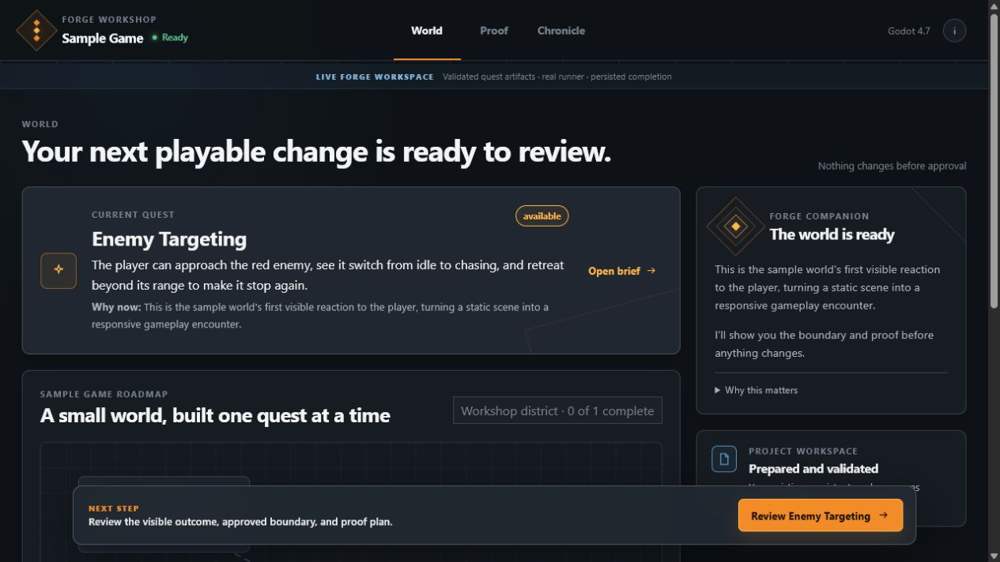
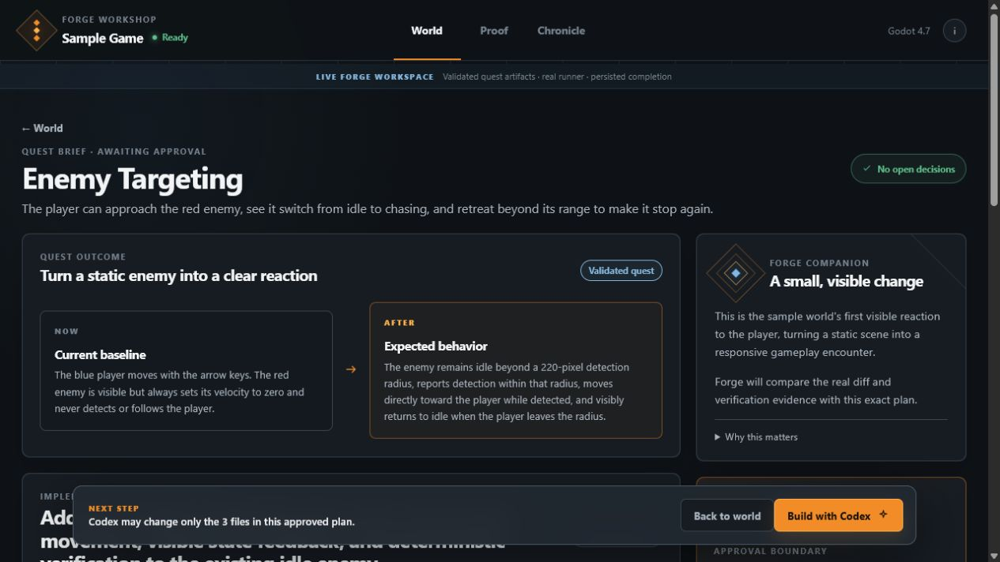

# Forge

### Turn Codex into your game development companion.

Forge turns AI-assisted game development into a visual, guided series of quests. Instead of starting with a blank chat, creators see where their game is going, choose what to build next, approve a clear plan, and watch Codex turn that plan into a playable result.

> **Forge is the platform. The assistant is your companion.**

[](https://openai.devpost.com/)


## Demo

The public three-minute video, deployed showcase, and Devpost links will be added during final submission packaging. The verified local path and current owner actions are in the [v0.2 judge guide](docs/JUDGE_GUIDE.md).



### Public Build Week showcase

The separate static showcase gives a no-install explanation and guided replay of both verified v0.2 workflows. It cannot run Forge operations and is not a replacement for the local application.

```powershell
npm run showcase
```

Build and validate the deployable static output with `npm run showcase:check`; run the responsive Microsoft Edge review with `npm run showcase:review`. See [`showcase/README.md`](showcase/README.md) for content, evidence, public-link, and deployment ownership. The final public showcase, demo-video, and Devpost URLs remain pending owner configuration.

## The Build Week experience

The current alpha focuses on one polished workflow:

```text
Name a Godot project
    ↓
Describe the game idea
    ↓
Shape systems and quests
    ↓
Choose one quest and its files
    ↓
Review the plan
    ↓
Build with Codex
    ↓
Verify the change
    ↓
Play the result
    ↓
Complete the quest
    ↓
Continue with the next quest
```

The active path creates one small neutral Godot project before asking what kind of game it will become. Inside Project World, an ordinary idea becomes broad systems, each system becomes smaller quests, and the creator approves the exact one-to-four-file work plan for one quest at a time. Forge recommends a next available quest without deciding what the creator is allowed to imagine.

After approval, Forge gives Codex a bounded work packet, translates technical activity into understandable progress, verifies the real project, launches the game, and updates the quest, system, roadmap, History, project notes, and local Git record only after the creator chooses **Worked**. The protected Enemy Targeting sample remains available as compatibility evidence.

## Judge quick start

### Requirements

- 64-bit Windows 10 or 11
- Node.js 20.19.x, or Node.js 22.12 or newer
- Git 2.x
- A Codex-capable ChatGPT or OpenAI API account
- Internet access for dependency installation, the first Godot download, and the live Codex run

Godot and a separate global Codex CLI do not need to be installed in advance. The locked npm dependencies include the official Codex SDK and CLI, and Forge downloads a pinned portable Godot build only after the explicit command below.

### Clean repository launch

```powershell
git clone https://github.com/MechanizedIT/forge-game-dev.git
cd forge-game-dev
npm ci
npx codex login status
# If the status command says you are signed out:
npx codex login
npm run demo:prepare -- confirm-download
npm run forge
```

`npx codex login` opens the official browser sign-in flow; API-key users may use the CLI's documented API-key login instead. Do not place credentials in this repository.

The prepare command is explicit consent for the approximately 84 MB first-time Godot download. Forge checks the pinned SHA-256 before extraction and reports whether the build came from `download` or `cache`. After setup, `npm run forge` builds the dashboard, starts the local host, prints `http://127.0.0.1:4173/v0.2.html`, and opens the Living Game Workshop in the default browser. Forge stores the generated demo and Godot cache under `%LOCALAPPDATA%\Forge`, not in the checkout.

`npm run forge:v0.1` remains the protected direct compatibility launch. `npm run forge:v0.2` is retained as an explicit alias for the default v0.2 workshop.

To run only the current Godot fixture foundation, see [`docs/GODOT_FIXTURE.md`](docs/GODOT_FIXTURE.md).

To run only the playable baseline:

```powershell
npm ci
npm run demo:prepare -- confirm-download
npm run demo:play
```

The first prepare asks for explicit permission through `confirm-download`, verifies the pinned Godot 4.7 archive before extraction, and caches it for later runs. No manual Godot installation or path lookup is required.

### Run the connected Forge Workshop dashboard

```powershell
npm run forge
```

The dashboard reads the real persistent workspace, prepared quest and plan, roadmap, review evidence, and completion artifacts. **Build with Codex** starts the existing official SDK runner exactly once. Friendly progress arrives live; raw sanitized events stay behind technical disclosure. **Play the result** launches the verified Godot workspace and completion persists only after the creator explicitly chooses **I saw it work**.

### Create a new game

Choose **Start a new game**, enter a project name, and choose **Create and open**. Forge copies only the controlled neutral Godot foundation, validates its records, runs the pinned Godot check, creates a clean local Git baseline, and registers the project last. No game type, template, capability, or model call is required to create the workspace.

In Project World, choose **Shape systems** and describe the game in ordinary words. Confirm the roadmap, refine one system into quests, prepare an available quest, review the exact files, and send the work to Codex. After the checks pass, play the game and choose **Worked** to save the result. Completing a quest unlocks the next dependency-safe quest.

### Open a generated Project World

Run `npm run forge`, then choose **Open Project World** on a recent-project card. Forge resolves only the registered project ID, validates its project-local manifest and artifacts, and opens its persisted roadmap without regenerating the project. Saved systems, quests, work orders, results, History, and the next available quest survive a full Forge restart.

Older starter-aware projects still show their labelled verified preview and retain their existing compatibility behavior. A new neutral project begins as a runnable foundation; its actual game appears only through creator-approved quests. Saving an idea for later remains separate from roadmap and Chronicle mutation.

For repeatable verification:

```powershell
npm run project:world:rehearse
npm run visual:review:v0.2:project-world
```

### Run the live Enemy Targeting quest

The original command-line golden path remains available:

```powershell
npm run quest:run -- enemy-targeting
```

Forge validates the prepared quest and plan, explains the bounded three-file change, and waits for you to type `APPROVE`. It then uses the official `@openai/codex-sdk`, shows five plain-language stages, verifies the real Git diff and Godot result, and writes evidence under the demo workspace's `.forge/runs/` directory. After a successful automated review, Forge offers to launch the game and completes the quest only when you explicitly enter `I SAW IT WORK` after the game closes.

For an explicitly approved non-interactive SDK run, use `npm run quest:run -- enemy-targeting confirm-run`; without an interactive terminal, it stops before creator confirmation and leaves the quest incomplete. Ordinary `npm test` runs use a fake SDK and do not contact Codex. See [`docs/QUEST_CLI.md`](docs/QUEST_CLI.md) for reset, safety, and result details.

## Recommended test path

1. Run `npm run forge`.
2. Select the **Enemy Targeting** quest.
3. Review the companion's explanation and implementation plan.
4. Choose **Build with Codex** and approve the mission.
5. Follow the simplified progress updates.
6. Launch the Godot game when prompted.
7. Move near the enemy and confirm it detects and chases the player.
8. Return to Forge to see verification evidence and the completed roadmap node.

If verification, launch, rejection, or cancellation fails, Forge preserves the evidence and leaves the roadmap incomplete. The dashboard does not contain a mocked judge-state controller; ordinary automated tests use injected fake SDK and launcher dependencies offline.

Live GPT planning and Codex execution may take several minutes. Forge shows real elapsed time and stage changes without inventing a duration estimate.



## Reset and replay

Reset is intentionally destructive only to Forge's generated demo workspace. It does not remove the repository checkout or the verified Godot cache.

1. Stop Forge with `Ctrl+C` in the terminal that is running it.
2. Reset the generated demo workspace.
3. Launch Forge again.

```powershell
npm run demo:reset -- confirm-reset
npm run forge
```

The roadmap should return to **0 of 1 complete** with Enemy Targeting available. Stopping and restarting the host is required so no in-memory completion notice from the prior run remains on screen.

## Common recovery

- **Port 4173 is already in use:** close the other Forge terminal, or run `$env:FORGE_PORT=4174; npm run forge` and open the printed URL.
- **Codex reports an authentication problem:** stop Forge, run `npx codex login status`, use `npx codex login` if needed, then relaunch.
- **GPT-5.6 planning is unavailable:** configure an authorized OpenAI API key/model entitlement and retry. Forge stops safely and does not substitute another model.
- **Godot download fails:** confirm internet access and rerun `npm run demo:prepare -- confirm-download`; incomplete downloads are not installed as a valid cache.
- **A quest fails or is cancelled:** read the preserved dashboard evidence. To return to the immutable starting point, use the stop/reset/relaunch sequence above.

## What makes Forge different

Most AI coding tools begin with an empty prompt and return technical output. Forge adds a human-centered experience around Codex:

- **Visual project direction:** A roadmap of landmarks and quests replaces disconnected chat sessions.
- **Bounded work:** Every quest defines its outcome, context, acceptance criteria, and verification path.
- **Human approval:** The creator sees what Codex is about to do before implementation begins.
- **Plain-language communication:** Technical details remain available without becoming the primary experience.
- **Tangible progress:** A completed quest produces a playable change, evidence, and visual feedback.
- **Persistent understanding:** Roadmap state, plans, handoffs, and decisions survive the session.

## How Forge uses Codex and GPT

Codex performs the repository work: inspecting the focused game context, planning the implementation, changing files, running checks, reviewing results, and producing structured handoffs.

Forge governs the experience: selecting the quest, bounding context, requesting approval, tracking workflow state, recording evidence, translating activity into player-friendly updates, and advancing the roadmap.

Focused GPT reasoning stages support the loop:

1. **Plan** — turn a gameplay goal into a concrete plan and acceptance criteria.
2. **Implement** — guide Codex with the approved plan and relevant project context.
3. **Review** — compare the change and evidence with the approved quest.
4. **Explain** — tell the creator what changed, what was verified, and what to do next.

The guiding principle is simple:

> **Models reason. Deterministic systems govern.**

## Prototype architecture

```text
Forge dashboard
      ↓
Quest + roadmap state
      ↓
Focused Codex skills
      ↓
Godot project changes
      ↓
Automated verification
      ↓
Plain-language result
      ↓
Updated roadmap
```

The Build Week workflow is deliberately small:

```text
PLAN → APPROVE → IMPLEMENT → REVIEW → DOCUMENT → COMPLETE
```

## What Forge is becoming

Today, Forge is a focused Godot alpha proving that an open-ended game idea can become a visual roadmap, several understandable quests, and a verified playable game through repeated creator-approved Codex work.

The longer-term vision is a project operating system for AI-assisted creators:

```text
Idea → Vision → Roadmap → Quest → Implementation → Evidence → Progress
```

Future versions may discover more project context, support additional engines, deepen long-term decision history, and adapt the companion to each creator's experience level. The goal is not to remove creators from development; it is to help more people direct complex projects without losing understanding or control.

## Build Week provenance

Forge existed before Build Week as a broader product concept and experimental repository. This submission is a focused new implementation of the game-development companion experience.

- Prior project: [MechanizedIT/Project-Forge](https://github.com/MechanizedIT/Project-Forge)
- Baseline and prior-work disclosure: [`BUILD_WEEK_BASELINE.md`](BUILD_WEEK_BASELINE.md)
- Implementation roadmap: [`ROADMAP.md`](ROADMAP.md)
- Architecture and sequenced build plan: [`docs/BUILD_PLAN.md`](docs/BUILD_PLAN.md)
- AI work log: [`docs/AI_WORK_LOG.md`](docs/AI_WORK_LOG.md)

The judge testing path is fully contained in this repository; the prior project is background only.

## Prototype limitations

- Forge creates new Forge-owned Godot projects; arbitrary existing-project import is not implemented.
- Godot is the only supported engine in the current alpha.
- Repository scanning is intentionally limited.
- Windows is the primary tested platform.
- The companion lives inside Forge rather than in an operating-system-level overlay.
- Live implementation requires Codex authentication and internet access.
- File scope is limited to one to four creator-approved Godot text files per quest; art generation, export, publishing, and autonomous multi-quest work are not implemented.

## Built with

Codex · GPT · TypeScript · React · Godot 4 · Node.js · Git

## License

A repository license still requires the submission owner's explicit selection before release.
