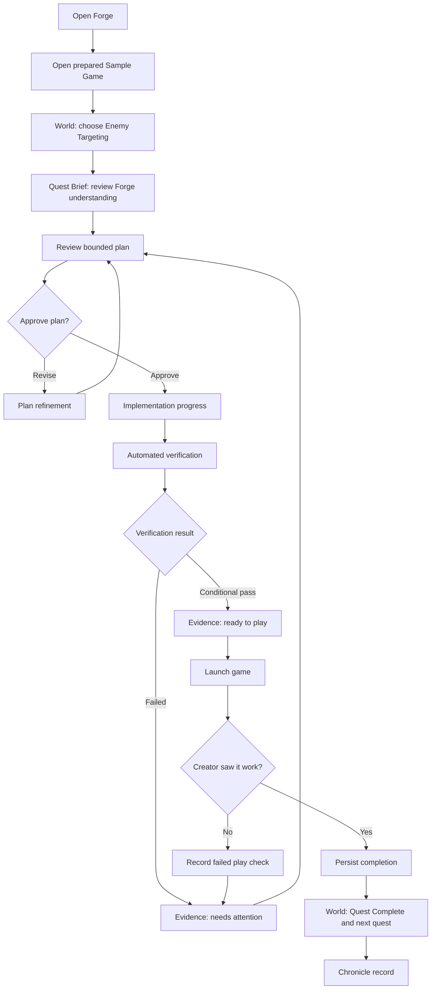
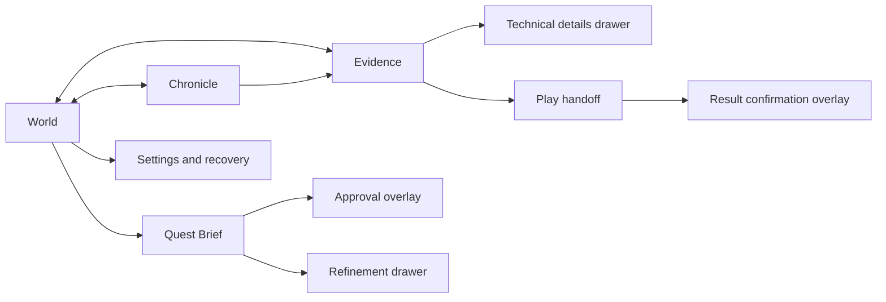

# Build Week Dashboard Capability and Screen Map

**Status:** Product-design source of truth

**Audience:** Forge owner, dashboard designer, and Build Week implementer

**Scope:** OpenAI Build Week / Devpost prototype only

**Last reviewed:** 2026-07-13

## Repository basis and status language

This document is grounded in the current `forge-game-dev` repository. The main sources are the [product promise and judge path](../README.md), [Build Week roadmap](../ROADMAP.md), [architecture and build plan](BUILD_PLAN.md), [current project status](../PROJECT_STATUS.md), prepared [roadmap](../fixtures/godot/baseline/.forge/roadmap.json), [quest](../fixtures/godot/baseline/.forge/quests/enemy-targeting.json), and [plan](../fixtures/godot/baseline/.forge/plans/enemy-targeting.json), plus the working quest runner and its [sanitized live evidence](evidence/2026-07-13-enemy-targeting-cli-live.json).

Four labels are used consistently:

- **Implemented:** Executable behavior or validated data exists in this repository now.
- **Planned:** The repository explicitly commits to the capability for the Build Week prototype, but it is not implemented.
- **Deferred:** A longer-term Forge concept or stretch goal that should not appear as functional prototype scope.
- **Owner review:** A gap or contradiction cannot be resolved from current repository evidence.

Important repository limitation: there is no React dependency, React screen, dashboard implementation, storyboard, landmark contract, or separate dashboard/workspace vision document in this repository or its current Git history. README images are placeholders. The design below therefore treats the dashboard as planned and uses the working CLI, JSON contracts, and Build Week documents as its source of truth. Prior Forge materials should influence this prototype only after they are deliberately added or cited.

## 1. Prototype objective

The dashboard must prove that Forge is a trustworthy control surface around Codex, not a chat wrapper and not an analytics dashboard. During one polished Enemy Targeting journey, it must let a first-time user see the project as a small quest world, understand the proposed outcome and boundaries, make the meaningful approval decision, follow understandable implementation stages, inspect evidence, play the changed game, and explicitly confirm the visible result before Forge records completion.

The central product claim is:

> Forge turns intent into a bounded, understandable, verified, and playable quest while keeping the creator in control.

For Build Week, breadth is less important than completing that loop honestly. The prepared quest is the deterministic demonstration path. Describing a new idea is a secondary proof path only after the prepared path is repeatable.

## 2. Target user and judge experience

### Target user

The primary user is a game creator who can describe the experience they want but may not be comfortable supervising raw agent output, Git diffs, or engine test commands. The interface should also remain credible to a technical judge by making scope and evidence available through progressive disclosure.

### First 10 seconds

The judge should understand:

- This is the **Sample Game**, presented as a small world of quests.
- **Enemy Targeting** is the obvious available next quest.
- Forge has a companion that explains the current situation in plain language.
- There is one obvious action: **Review Enemy Targeting**.

The initial screen should not lead with setup status, logs, token counts, percentages, generic metrics, or a blank prompt.

### First minute

The judge should understand:

- What the game does now and what will visibly change.
- Why this quest matters to the game.
- What Forge inspected and which files are relevant.
- What Codex is allowed to change and what is explicitly out of scope.
- How the result will be checked automatically and by playing it.
- Nothing meaningful starts until the judge approves the plan.

The key trust moment is the transition from **Review plan** to **Build with Codex**.

### Full demonstration

The judge should experience the complete trust loop:

1. Select the prepared project and quest.
2. Review Forge's understanding and bounded plan.
3. Approve implementation.
4. See five understandable stages without a terminal feed taking over the experience.
5. See automated checks and changed-file scope summarized with evidence.
6. Launch and play the game.
7. Choose **I saw it work** only after observing the mechanic.
8. See the quest complete, the world update, and a concise record of what changed.

The judge should leave understanding that Codex performed real repository work while Forge governed scope, approval, evidence, and progression.

## 3. Capability inventory

Priority meanings: **Must** is required for the golden path; **Should** improves clarity or resilience after the loop works; **Optional** is polish; **Defer** should not consume Build Week implementation time.

| Capability | User value | Priority | Current status | Repository evidence | Dashboard? | Prototype? |
|---|---|---:|---|---|---:|---:|
| Open bundled Sample Game | Gives the judge a safe, known starting point | Must | Implemented without UI | Workspace prepare/preserve/reset exists in [workspace code](../src/demo/workspace.ts) and the fixture is documented in [GODOT_FIXTURE.md](GODOT_FIXTURE.md) | Yes | Yes |
| Pinned Godot acquisition | Removes a manual engine-install dependency while preserving consent | Must | Implemented without UI | [README quick start](../README.md) and [project status](../PROJECT_STATUS.md) describe approved download and checksum behavior | Secondary setup only | Yes |
| Project readiness summary | Explains whether the project, workspace, Codex, and Godot path are ready | Must | Partially implemented as CLI validation | Runner rejects invalid artifacts or dirty workspaces; no combined readiness view exists ([CLI guide](QUEST_CLI.md)) | Yes, concise | Yes |
| Visual quest world | Replaces a task list with visible project direction | Must | Planned | [ROADMAP Milestone 2](../ROADMAP.md) requires locked, available, active, and completed states; current JSON supports positions and those states | Yes, primary | Yes |
| Multiple roadmap choices | Makes the world feel directional rather than scripted | Should | Contradicted / incomplete | [ROADMAP](../ROADMAP.md) names Enemy Targeting, Player Dash, and Damage Feedback, but the fixture [roadmap JSON](../fixtures/godot/baseline/.forge/roadmap.json) contains only Enemy Targeting | Yes | Yes, as lightweight prepared nodes |
| Landmark or chapter hierarchy | Groups quests into larger world goals | Optional | Deferred / no contract | README uses “landmarks” conceptually, but [roadmap schema](../src/contracts/roadmap.ts) models only quest nodes | Visual framing only; do not imply data support | Not as a functional system |
| Prepared quest selection | Starts a reliable bounded journey | Must | Implemented in data and CLI; UI planned | [Enemy Targeting quest](../fixtures/godot/baseline/.forge/quests/enemy-targeting.json) and fixed bundle loader exist | Yes | Yes |
| Describe a new quest in plain language | Proves Forge can structure fresh intent | Should | Planned after golden path | [ROADMAP Milestone 5](../ROADMAP.md) explicitly sequences this after completion and packaging work | Secondary entry point | Yes only if core path is repeatable |
| Forge understanding / quest brief | Lets the user correct intent before planning or implementation | Must | Implemented as structured quest data; no UI | Quest fields include outcome, importance, baseline, expected behavior, scope, context, criteria, and verification in [quest schema](../src/contracts/quest.ts) | Yes | Yes |
| Focused project context inspection | Shows what Forge knows without pretending to scan everything | Must | Implemented for the prepared quest | The bounded context uses declared files; broad scanning is excluded in [CLI plan](plans/2026-07-13-enemy-targeting-cli.md) | Yes, summarized | Yes |
| Reviewable implementation plan | Makes the proposed work understandable before action | Must | Implemented as prepared JSON; no UI | [Prepared plan](../fixtures/godot/baseline/.forge/plans/enemy-targeting.json) maps steps to files and criteria | Yes | Yes |
| Plan assumptions and exclusions | Prevents hidden scope and surfaces uncertainty | Must | Implemented in contract | [Implementation plan schema](../src/contracts/implementation-plan.ts) contains assumptions, excluded work, and open decisions | Yes | Yes |
| Refine plan | Keeps the user in control when the plan is wrong | Should | Planned, not implemented | [BUILD_PLAN](BUILD_PLAN.md) says refinement creates a new plan revision; [ROADMAP Milestone 2](../ROADMAP.md) calls for Refine plan | Yes | Yes, bounded revision flow |
| Ask a contextual question | Supports understanding without turning the product into chat | Should | Planned, not implemented | [README](../README.md) and [ROADMAP Milestone 2](../ROADMAP.md) name contextual questions | Companion/Brief only | Yes, if tightly scoped |
| Meaningful approval gate | Prevents implementation until the plan is accepted | Must | Implemented in CLI; UI planned | Exact `APPROVE` is required and cancellation starts no SDK turn ([CLI review](reviews/2026-07-13-enemy-targeting-cli-review.md)) | Yes, dominant decision | Yes |
| Bounded Codex delegation | Performs real repository work inside approved limits | Must | Implemented without UI | Official SDK, workspace isolation, declared files, and no network are evidenced in [CLI handoff](handoffs/2026-07-13-enemy-targeting-cli.md) | Trigger and status only | Yes |
| Plain-language progress | Shows what is happening without agent noise | Must | Implemented in CLI; UI planned | Five ordered messages exist in [progress reducer](../src/quest-runner/progress.ts) | Yes | Yes |
| Raw technical detail disclosure | Lets technical users audit commands and logs | Should | Evidence exists; UI planned | Sanitized events, diff, handoff, and review are written per [CLI guide](QUEST_CLI.md) | Drawer from progress/evidence | Yes |
| Cancel active implementation | Preserves agency during work | Should | Cancellation exists only before SDK start | Pre-run cancellation is tested; mid-run cancellation is planned in [BUILD_PLAN](BUILD_PLAN.md) | Contextual secondary action | Yes if runtime supports it safely |
| Automated verification | Replaces “agent says done” with checks | Must | Implemented | Live run passed `VERIFY-1` and `VERIFY-2` in [sanitized evidence](evidence/2026-07-13-enemy-targeting-cli-live.json) | Yes | Yes |
| Acceptance-criterion evidence | Connects each promise to proof | Must | Implemented in review artifacts; no UI | [Review result schema](../src/contracts/review-result.ts) records criterion results and evidence IDs | Yes | Yes |
| Changed-file and scope review | Shows whether Codex stayed within the plan | Must | Implemented | Actual Git diff and unexpected-file detection drive verdicts in [review logic](../src/quest-runner/review.ts) | Yes | Yes |
| Game launch | Makes the result tangible | Must | Implemented as a separate command; integrated flow planned | `npm run demo:play` exists; [PROJECT_STATUS](../PROJECT_STATUS.md) says integrated launch-and-confirm is incomplete | Yes | Yes |
| Creator play confirmation | Prevents automated checks from falsely claiming visible success | Must | Contracted, not implemented end to end | Automated success remains `CONDITIONAL PASS`; AC-6 is `pending_play` in [live evidence](evidence/2026-07-13-enemy-targeting-cli-live.json) | Yes, primary result action | Yes |
| “It did not work” path | Preserves trust when manual verification fails | Must | Planned implicitly; no closeout path | Review contract supports failed play, but current runner always records `not_run` ([review schema](../src/contracts/review-result.ts)) | Yes | Yes |
| Persistent quest completion | Makes progress survive restart | Must | Planned, not implemented | [ROADMAP Milestone 4](../ROADMAP.md); current live run deliberately leaves roadmap `available` | Yes | Yes |
| Quest Complete feedback | Provides a satisfying small win | Should | Planned | Pulse, companion change, sound, and concise card are in [ROADMAP Milestone 4](../ROADMAP.md) | Yes | Yes, restrained |
| Contextual next quest | Makes the world feel continuous | Should | Planned, blocked by missing nodes | [ROADMAP Milestone 4](../ROADMAP.md) calls for unlock or recommendation | Yes | Yes if extra nodes exist |
| Chronicle / project record | Keeps a concise history of decisions, runs, and outcomes | Must, concise | Data partially exists; UI and runtime index do not | Runs store plans, events, diffs, handoffs, and reviews; “persistent understanding” is explicitly file-based in [BUILD_PLAN](BUILD_PLAN.md) | Yes, secondary screen | Yes |
| Companion guidance | Explains meaning, decisions, and next action | Must | Planned | Persistent in-app companion is [ROADMAP Milestone 2](../ROADMAP.md); OS overlay is stretch | Yes, persistent rail/card | Yes |
| Failure, retry, and blocked states | Keeps the experience honest and recoverable | Must | Fail verdict exists; UI and recovery planned | [ROADMAP Milestone 3](../ROADMAP.md) and [BUILD_PLAN](BUILD_PLAN.md); failed live run was preserved rather than relabeled | Yes | Yes |
| Reset demo | Restores a repeatable judge baseline without silent data loss | Must for rehearsal | Implemented without UI | Explicit confirmed reset and dirty-workspace refusal are documented in [CLI guide](QUEST_CLI.md) | Settings/secondary | Yes |
| Labeled replay fallback | Protects the demo from network/runtime failure without misrepresentation | Should | Planned, not implemented | [BUILD_PLAN](BUILD_PLAN.md) requires a visibly labeled sanitized replay | Secondary recovery path | Yes |
| Generic chat home | Familiar prompt entry | Defer | Not implemented and contrary to product promise | [README](../README.md) differentiates Forge from blank chat | No | No |
| Broad repository scanning | Works with arbitrary projects | Defer | Explicitly excluded | [AGENTS.md](../AGENTS.md) and [ROADMAP](../ROADMAP.md) defer general scanning | No | No |
| Multi-engine, provider, account, or team systems | Platform breadth | Defer | Explicitly excluded | [AGENTS.md](../AGENTS.md) scope boundaries | No | No |
| Currency, inventory, leveling, or deep avatar systems | More game mechanics | Defer | Explicitly excluded | [AGENTS.md](../AGENTS.md) and [ROADMAP](../ROADMAP.md) | No | No |

### Capability conclusion

The dashboard should expose existing capability rather than simulate missing systems. Its required data path is: prepared project and quest artifacts → approved plan → real runner stages → diff and review evidence → game launch → explicit play result → persistent roadmap closeout. Anything outside that chain is secondary.

## 4. Workflow state model

The interface needs a user-visible state model in addition to the existing internal workflow and roadmap enums. Do not use `PLAN`, `APPROVE`, or `REVIEW` as the main user copy. Keep them in technical details.

| User-visible state | What the user sees | What Forge communicates | Available actions | Required evidence | Next transition |
|---|---|---|---|---|---|
| **No project selected** | Welcome surface with one prepared Sample Game card | “Open the prepared world to begin.” | **Open Sample Game**; secondary setup help | Fixture availability; project path after preparation | Project ready, or blocked |
| **Project ready** | World map, project summary, available quest emphasized | What currently works and why Enemy Targeting is next | **Review Enemy Targeting**; choose another available node; describe an idea only if enabled | Valid roadmap, quest reference, workspace readiness | Choosing a quest |
| **Choosing a quest** | Selected node preview and visible neighboring choices | Outcome, importance, and current baseline | **Open quest brief**; choose another node | Valid quest artifact and roadmap state | Understanding intent |
| **Understanding intent** | Quest Brief with “Now,” “After,” “Included,” and “Not included” | What Forge believes the user wants and what context it gathered | **Review the plan**; revise understanding; ask a focused question; back to world | Quest artifact, context file list, unresolved decisions | Plan ready for review, or blocked |
| **Plan ready for review** | Plain-language steps, files, criteria, checks, assumptions, exclusions | What Codex will do and how Forge will judge it | **Continue to approval**; refine plan; back | Valid plan revision linked to quest | Awaiting approval |
| **Awaiting approval** | Decision-focused confirmation overlay or page; no competing CTA | “Nothing changes until you approve this bounded plan.” | **Build with Codex**; revise plan; cancel | Plan revision, allowed files, checks, open decisions = none | Implementation running, or back to plan |
| **Implementation running** | Current stage, completed stages, short companion message, quiet world state | What Forge is doing now and why; uncertainty if present | View details; cancel only if safely supported | Run ID, approved plan snapshot, sanitized stage events | Verification running, blocked, or failed |
| **Verification running** | Automated checks in progress; implementation stage complete | “Forge is comparing the actual change with the approved quest.” | View details; no duplicate start action | Captured Git diff, declared verification execution | Result ready, failed verification, or blocked |
| **Result ready for inspection** | Conditional-pass card, changed files, criteria proof, prominent play action | Automated checks passed, but Forge will not claim completion until the user sees it | **Play the result**; inspect evidence; report a problem | Review verdict, scope result, pending play criterion | Game active / remains result ready |
| **Result accepted** | Quest Complete card and updated world node | What changed, what passed, and that the user confirmed the visible result | **Return to world** / view next quest; view chronicle | Play check passed, all criteria passed, closeout persisted | Completed project-ready state |
| **Blocked / needs user action** | Cause-specific card replacing the normal CTA | Plain-language cause, what was preserved, and exact recovery | The one relevant recovery action; details; return safely | Structured reason such as dirty workspace, missing auth, missing Godot, or unresolved decision | Prior safe state after recovery |
| **Failed verification** | Failed checks and affected criteria, no completion celebration | “The change is not verified. Forge has not completed the quest.” | **Review the problem**; retry from approved plan when supported; reset only through settings | Failed command result, criterion mapping, diff, preserved run | Implementation running on retry, plan review, or project ready |

### State ownership rule

Keep three types of state separate in both implementation and copy:

- **Roadmap state:** `locked`, `available`, `active`, `completed` describes a quest node over time.
- **Run workflow:** `PLAN → APPROVE → IMPLEMENT → REVIEW → DOCUMENT → COMPLETE` governs one attempt.
- **View state:** selection, open drawer, loading state, and current route are transient UI concerns.

The current contracts support the first two imperfectly: roadmap and run artifacts exist, but the architecture's proposed `.forge/state.json` does not. Before UI implementation, choose one deterministic source for the current run and current focus; do not infer durable state from which screen was last open.

## 5. Information architecture

### Recommended naming model

Use **World** as the home screen rather than “Dashboard.” The user should feel they returned to their game-development world, not a reporting console.

| Working concept | Recommendation | Reason |
|---|---|---|
| Current Focus | **Current Quest** | Concrete and understandable; becomes “Choose your next quest” when idle |
| Project World | **World Map** | Strong game-world metaphor backed by positioned quest nodes |
| Forge Companion | **Forge Companion** | Already central to the product promise; its name is less important than its role |
| Brief | **Quest Brief** | Makes the scope explicit and keeps it contextual to a quest |
| World | **World** | Best primary/home navigation label |
| Evidence | **Proof** in creator copy; **Evidence** in technical details | “Proof” is plainer, while evidence remains accurate for audit detail |
| Chronicle | **Chronicle** | Supports the world metaphor and a concise persistent record |
| Contextual next action | No nav label; use one state-derived action | The action should be the most visually prominent control, not another destination |

### Primary navigation

Use only three persistent destinations:

1. **World** — home, current quest, roadmap, companion, and contextual next action.
2. **Evidence** — current/latest run proof first, with older runs secondary.
3. **Chronicle** — concise record of completed and failed quest attempts, decisions, and changes.

The **Quest Brief** is not a permanent global destination. It opens from a selected quest as a focused page or large panel. This reduces navigation chrome and keeps the user's mental model centered on the world.

### What belongs on the main World screen

- Project identity and a short, honest readiness status.
- Current quest or next available quest.
- Small visual roadmap with quest states and dependencies.
- Persistent companion guidance tied to the current state.
- A concise “what Forge knows/proposes/needs from you” summary.
- Latest proof only when it changes the next decision.
- Exactly one dominant next action.

### What belongs in Quest Brief

- Player-visible outcome and why it matters.
- Current behavior versus expected behavior.
- Included and excluded scope.
- Relevant project context, summarized before file names.
- Plan revision, assumptions, steps, affected files, criteria, and verification.
- Revise, question, approve, or return actions.

### What belongs in World

- Quest nodes and their state.
- Dependencies and the next recommended node.
- Completion pulse and light visual progression.
- No issue backlog, sprint board, burndown, velocity, or generic progress percentage.

### What belongs in Evidence

- Verdict in plain language.
- Acceptance criteria with passed, failed, or needs-play states.
- Changed files and approved-scope comparison.
- Automated checks and concise output tokens.
- Manual play check.
- Technical details drawer for commands, sanitized logs, diff, run ID, and Codex thread ID.

### What belongs in Chronicle

- Quest attempt title, result, date, plan revision, creator decision, concise change summary, and evidence link.
- Failed attempts remain visible and honestly labeled.
- The latest completion can point back to its world node.
- No transcript archive, hidden reasoning, or raw terminal history as the primary record.

### Settings and secondary surfaces

- Godot/Codex readiness and paths.
- Explicit **Reset demo** with confirmation.
- Replay fallback with a permanent **Replay** label.
- Technical diagnostics and version information.
- Accessibility, audio, and reduced-motion controls.

### Remove, defer, or combine

- Combine **Current Focus** and the contextual next action into one **Current Quest** card.
- Keep the companion as a supporting rail/card, not a full chat page.
- Do not create a separate project-management “Overview.” World is the overview.
- Do not add KPI cards, percent complete, velocity, token usage, time saved, or agent-activity feeds.
- Do not add a global **Brief** nav item.
- Defer currencies, inventory, levels, team activity, marketplace, model selection, broad scanning, and engine switching.

## 6. Main dashboard anatomy

The desktop composition is a two-column World stage: a wide project-world column and a narrower companion column. On smaller widths, the companion becomes an inline card below Current Quest, not a floating chat bubble.

### Region 1 — Project header

- **Purpose:** Establish which project is open and whether the golden path is ready.
- **Information:** Project name; engine; concise readiness label; primary navigation; settings icon.
- **Primary action:** None when ready; the page's quest action must remain dominant.
- **Secondary action:** Open setup details or settings.
- **Empty:** “No project open” with **Open Sample Game**.
- **Working:** “Preparing Sample Game” with the exact current setup stage, not a percentage.
- **Success:** “Sample Game · Ready.”
- **Error/blocked:** Short readiness cause with **Resolve setup**.

### Region 2 — Current Quest

- **Purpose:** Answer “What is happening now, why does it matter, and what do I need to do?”
- **Information:** Quest name; one-sentence outcome; current state; why it matters; the next user decision.
- **Primary action:** State-derived: Review quest, Review plan, Build with Codex, Play result, or Confirm result.
- **Secondary action:** Choose another quest, revise, inspect proof, or report that play failed—only when relevant.
- **Empty:** “Choose your next quest” with Enemy Targeting recommended.
- **Working:** Current Forge stage and last completed stage.
- **Success:** “Enemy Targeting verified; ready to play,” then “Quest complete” only after confirmation.
- **Error/blocked:** Cause and one recovery action; preserve the approved plan and evidence.

### Region 3 — World Map

- **Purpose:** Make project direction and progression spatial and tangible.
- **Information:** A small path of locked, available, active, and completed quest nodes; selected node summary; dependency lines.
- **Primary action:** Select an available quest.
- **Secondary action:** Inspect completed quest or locked requirement.
- **Empty:** A single prepared path is acceptable, but it must not imply nonexistent quests. Prefer adding the repository-planned Player Dash and Damage Feedback metadata before design polish.
- **Working:** Keep nodes visible; pulse only the active quest and completed stage boundary.
- **Success:** Completed node changes state once, with a restrained pulse and path to the next node.
- **Error/blocked:** Mark only the affected node; the rest of the world remains navigable.

### Region 4 — Forge Companion

- **Purpose:** Translate state into meaning and guide the next decision.
- **Information:** One short message; one optional “Why?” disclosure; current confidence or uncertainty only when actionable.
- **Primary action:** The companion should usually point to, not duplicate, the page's primary action.
- **Secondary action:** Ask a focused question or open an explanation.
- **Empty:** “Choose a quest and I’ll help you understand it before anything changes.”
- **Working:** Explain the current stage in one or two sentences.
- **Success:** Summarize the verified outcome and invite the play check.
- **Error/blocked:** Explain what Forge preserved and what choice is needed.

### Region 5 — Brief and Proof preview

- **Purpose:** Give just enough context for the next decision without turning World into a document viewer.
- **Information:** Two compact cards: “What will change” and “How Forge will prove it.” After implementation, replace the first with “What changed.”
- **Primary action:** Open Quest Brief or Evidence, depending on state.
- **Secondary action:** View affected files or criteria.
- **Empty:** Explain that proof appears after a quest is selected.
- **Working:** Show plan snapshot and pending check labels; never fake completed results.
- **Success:** Passed check count in words, scope result, and pending/complete play check.
- **Error/blocked:** Failed criterion summary and link to the preserved evidence.

### Region 6 — Contextual action dock

- **Purpose:** Keep one next action obvious even when content scrolls.
- **Information:** Primary action label plus a short consequence statement, such as “Codex may change 3 approved files.”
- **Primary action:** Exactly one state-derived action.
- **Secondary action:** At most one safe alternative plus an overflow for technical/rare actions.
- **Empty:** **Choose a quest**.
- **Working:** No duplicate start button; show **View progress** or safe cancel if supported.
- **Success:** **Play the result**, then **I saw it work**, then **Return to world**.
- **Error/blocked:** **Resolve setup**, **Review failure**, or **Revise plan**, selected deterministically from the cause.

## 7. Screen map

### Primary screens and overlays

| Surface | Type | Entry points | Main job | Exit points |
|---|---|---|---|---|
| Project entry | Primary screen | App launch without prepared workspace | Open or prepare Sample Game | World; Setup issue panel |
| World | Primary/home screen | Project entry; return from any flow | Show current quest, roadmap, companion, and next action | Quest Brief; Evidence; Chronicle; Settings |
| Quest Brief | Focused screen or large panel | Quest node; Current Quest card | Confirm Forge's understanding and review plan | Approval overlay; World; plan refinement |
| Plan refinement | Drawer or focused subflow | Quest Brief | Capture a bounded revision or answer an open decision | Revised Quest Brief; cancel to previous revision |
| Approval | Modal/overlay | Quest Brief after valid plan | Make the implementation boundary unmistakable | Implementation progress; back to plan |
| Implementation progress | Focused state of World | Approval | Show understandable real stages | Evidence result; blocked/failure panel; details drawer |
| Evidence | Primary screen | Progress completion; World preview; Chronicle | Connect criteria, checks, diff scope, and play check | Play launch; World; technical details |
| Play handoff | Overlay/panel | Evidence result | Explain what to observe and launch Godot | Game process; result confirmation |
| Result confirmation | Modal/overlay | Return/focus after launch | Record **I saw it work** or **It did not work** | Quest Complete; failed-play Evidence |
| Quest Complete | Overlay/card on World | Successful result confirmation and persisted closeout | Celebrate and summarize without hiding proof | World; next quest; Chronicle |
| Chronicle | Primary screen | Global navigation; Quest Complete | Show concise durable record | Evidence detail; World |
| Technical details | Drawer | Progress or Evidence | Reveal commands, files, diff, logs, IDs | Prior screen |
| Setup/recovery | Panel or settings screen | Readiness error; blocked run | Resolve Codex, Godot, dirty workspace, or replay fallback | Prior safe state |
| Settings | Secondary screen | Header | Reset demo, diagnostics, versions, accessibility | World |

### Judge journey

### Navigation and disclosure map

### Transition rules

- Approval cannot open until the plan is valid and has no unresolved decisions.
- Starting implementation snapshots the approved plan and disables duplicate starts.
- A failed or interrupted run never advances the roadmap to completed.
- Automated success produces **Ready to play**, not **Quest complete**.
- Only a passed play check can move review to documentation/completion.
- Quest completion must persist before the celebration is shown.
- Replay results must retain a visible **Replay** marker on progress, evidence, and Chronicle surfaces.

## 8. Three key dashboard states

### State 1 — Ready to choose a quest

#### Page hierarchy

1. Project header: `Sample Game · Ready`
2. Current Quest: `Choose your next quest`
3. World Map: Enemy Targeting highlighted as available; any real additional nodes shown accurately
4. Forge Companion
5. Quest preview / proof-method preview
6. Action dock: **Review Enemy Targeting**

#### Visible content

- One-sentence current project state: the player moves and the enemy is idle.
- Enemy Targeting outcome: make the enemy notice and chase the nearby player.
- Why it matters: the static scene becomes responsive.
- Roadmap state legend, shown visually rather than as a large key.
- Setup is shown simply as ready; details are available but quiet.

#### Primary call to action

**Review Enemy Targeting**

“Start quest” is too early because the judge has not reviewed Forge's understanding or plan.

#### Companion message

> The player can already move, but the enemy never reacts. Enemy Targeting is the smallest next quest that makes this world feel alive. I’ll show you the boundary and proof before anything changes.

#### Evidence displayed

- Project artifacts loaded successfully.
- Prepared quest and plan exist.
- Godot/Codex readiness may be summarized as “Ready”; file paths, versions, and checks stay behind setup details.
- No implementation evidence is shown because no run has begun.

#### Visual emphasis

- Emphasize the available Enemy Targeting node and its path.
- Use the companion as an interpreter, not the largest object.
- Keep the action dock visually strongest.

#### Keep hidden

- Raw project tree, full acceptance criteria, plan steps, SDK status stream, command list, empty charts, and prompt history.
- Do not show Player Dash or Damage Feedback as selectable until real quest/roadmap metadata exists.

### State 2 — Plan awaiting approval

#### Page hierarchy

1. Quest title and player-visible outcome
2. “Forge understands” summary: Now → After
3. Bounded plan steps
4. Scope boundary: 3 files allowed; exclusions summarized
5. Proof plan: automated checks plus visible play check
6. Assumptions and open decisions
7. Forge Companion
8. Action dock or approval overlay

#### Visible content

- `Now`: the red enemy is visible but never detects or follows the player.
- `After`: it detects within 220 pixels, chases directly, and returns to idle outside range.
- Four plan steps rewritten in creator language, with technical file names disclosed under each step.
- “Will change”: `main.tscn`, `scripts/enemy.gd`, `scripts/verify_fixture.gd`.
- “Will not change”: combat, navigation, multiple targets, art/audio, broad AI infrastructure.
- Proof: repository checks, deterministic Godot signals, and the judge's visible play confirmation.
- Plan revision 1, with no open decisions.

#### Primary call to action

**Build with Codex**

The consequence line should read: “Codex may change only the 3 files in this approved plan.”

#### Companion message

> I’ve reduced this to one visible behavior and three files. Forge will check idle, detection, chase, and player movement automatically, then ask you to play it before completing the quest.

#### Evidence displayed

- This is **planned proof**, not completed proof.
- Show criteria-to-check mapping in plain language.
- Show that the plan has no unresolved decisions.
- A technical disclosure may show exact criteria and commands.

#### Visual emphasis

- Emphasize outcome, scope boundary, proof, and approval.
- Make exclusions visually present but quieter than the intended result.
- Use a distinct approval treatment because this is the meaningful control boundary.

#### Keep hidden

- Raw quest JSON, full context file contents, exact prompt sent to Codex, SDK event types, terminal output, and unrelated roadmap nodes.
- Do not show progress animation before approval.

### State 3 — Verified result ready to play or inspect

#### Page hierarchy

1. Result banner: `Automated checks passed · Play confirmation needed`
2. Current Quest outcome and **Play the result** action
3. Acceptance proof summary
4. Changed-file and scope summary
5. What to look for in the game
6. Forge Companion
7. Evidence/technical disclosure

#### Visible content

- Passed: enemy idle outside range; detection inside range; chase distance reduced; player input preserved; project/Godot checks passed.
- Pending: visible `IDLE → CHASING → IDLE` play observation.
- Exactly three planned files changed; no unexpected files.
- The review verdict should be rendered as “Automated checks passed” or “Ready to play,” not the internal phrase `CONDITIONAL PASS` as the headline.
- Instructions: approach the red enemy, observe `CHASING` and movement, retreat, observe `IDLE`.

#### Primary call to action

**Play the result**

After launch/return, the result confirmation presents **I saw it work** as primary and **It did not work** as a clearly available secondary choice.

#### Companion message

> The change stayed inside the approved three files, and every automated check passed. I still need your eyes on the game: approach the red enemy, then retreat, and confirm both state changes.

#### Evidence displayed

- `VERIFY-1` passed.
- `VERIFY-2` passed with the four expected Godot signals.
- AC-1 through AC-5 passed; AC-6 awaits play.
- Scope passed; three expected files changed; no unexpected files.
- Full commands, diff, output token, run ID, and Codex thread ID remain in technical details.

#### Visual emphasis

- Emphasize the pending human proof and the playable result.
- Passed automated evidence should feel reassuring but visually secondary to **Play the result**.
- Do not trigger completion celebration yet.

#### Keep hidden

- “Quest Complete,” completed roadmap state, next-quest unlock, celebratory audio, or final Chronicle entry until play confirmation and persistence succeed.
- Do not lead with raw diff lines or logs.

## 9. Judge demonstration path

The repository contains no measured UI or runtime timings, so this plan does not invent estimates. The sequence is designed for the repository's stated three-minute demonstration goal, but implementation must measure it during clean-machine rehearsal.

| Step | Judge action | Forge response | Visible dashboard change | Expected evidence | Timing/dependency risk |
|---:|---|---|---|---|---|
| 1 | Launch Forge and open Sample Game | Prepares or reopens the persistent fixture | Project entry becomes World; readiness becomes Ready | Valid workspace and roadmap | First-run Godot download requires consent, network, checksum, and extraction; pre-warm or clearly rehearse |
| 2 | Select Enemy Targeting | Loads the prepared quest | Available node becomes selected; Current Quest and companion update | Valid quest-roadmap-plan linkage | Current roadmap contains only one node; additional choices need real metadata |
| 3 | Open Quest Brief | Summarizes intent and bounded context | Now/After, scope, and proof become visible | Quest fields and declared context files | Copy must stay plain while preserving exact 220-pixel behavior |
| 4 | Review plan | Loads plan revision 1 | Four steps, three allowed files, exclusions, and checks appear | Valid plan with no open decisions | Current plan is prepared rather than freshly generated; demo narration must be honest |
| 5 | Choose Build with Codex | Snapshots approval and starts one SDK turn | Approval closes; progress state appears | Approved plan snapshot, run ID, SDK thread | Requires Codex authentication and network; duplicate starts must be prevented |
| 6 | Observe progress | Maps events to five creator-facing stages | Current Quest and companion advance through stage labels | Sanitized events | SDK duration is unmeasured and variable; replay fallback is planned but absent |
| 7 | Wait for verification | Captures diff and runs approved checks | Progress moves from building to testing/reviewing | Git diff, command exits, Godot token | Local environment, subprocess, or Godot failures need clear recovery; a Windows npm issue occurred in an earlier live run |
| 8 | Inspect result | Presents scope and criterion proof | Evidence summary shows automated checks passed and play pending | AC-1–AC-5 passed; scope passed; AC-6 pending | The UI must not convert conditional pass into completion |
| 9 | Choose Play the result | Launches the prepared workspace in Godot | Play handoff remains available; on return, show confirmation | Game process launch and observation instructions | Integrated launch/return detection is not implemented; focus behavior requires rehearsal |
| 10 | Choose I saw it work | Records play pass and completes deterministic closeout | Quest node completes; concise celebration and next action appear | AC-6 passed, review PASS, persisted roadmap/Chronicle record | Closeout and persistence are not implemented; write failure must prevent false celebration |

### Demo fallback rule

If live Codex cannot run, a future sanitized replay may demonstrate screen behavior only if every affected surface says **Replay**. It must not be narrated or recorded as a live run. The repository currently plans this fallback but does not implement it.

## 10. Build Week scope boundary

### Must-have interface capabilities

- Open/reopen the prepared Sample Game and communicate readiness.
- World screen with a real roadmap and accurate quest states.
- Enemy Targeting selection and Quest Brief.
- Plain-language current/expected behavior, value, included scope, excluded scope, and relevant context.
- Prepared plan review with assumptions, steps, affected files, criteria, and proof plan.
- Meaningful approval and safe cancellation before implementation.
- Real Codex run connected to five understandable progress stages.
- Blocked, failed implementation, and failed verification presentations.
- Evidence view connecting actual change, allowed scope, checks, and criteria.
- Game launch and clear observation instructions.
- **I saw it work** and **It did not work** manual outcomes.
- Persistent completion only after automated and manual proof.
- Concise completion feedback and Chronicle entry.
- One deterministic contextual primary action per state.

### Should-have capabilities

- Two lightweight additional prepared roadmap choices so the World reads as direction, not a single button.
- Plan refinement as an explicit new revision.
- Focused companion question field within Quest Brief.
- Mid-run cancellation if SDK/runtime semantics can preserve evidence safely.
- Labeled sanitized replay fallback.
- Clear dirty-workspace, authentication, Godot, and retry recovery.
- Reduced-motion and audio controls.

### Optional polish

- Subtle node pulse, companion pose/state change, completion sound, and brief Quest Complete animation.
- Small environmental art treatment around quest nodes.
- Friendly names for proof categories while keeping exact details available.
- Next-quest recommendation after completion.

### Deferred long-term Forge capabilities

- Broad or autonomous repository discovery.
- Arbitrary project/engine support beyond the bundled Godot fixture.
- General idea-to-roadmap generation beyond one narrow secondary proof.
- Vector or generalized semantic memory.
- Multiple model providers or routing.
- Autonomous multi-agent orchestration.
- Accounts, cloud hosting, authentication systems, teams, and collaboration.
- Plugin/skill marketplace.
- Native always-on-top companion.
- Deep avatar animation system.
- Currencies, inventory, levels, skill trees, and broad progression mechanics.
- Production-scale security, deployment, and analytics.

### Features that could distract from the demonstration

- Analytics tiles, percentages, burndown charts, token/cost counters, and time-saved claims.
- A terminal or activity stream occupying the main content area.
- A blank, general-purpose chat composer on World.
- Multiple agents, model selectors, provider badges, or infrastructure topology.
- A dense file explorer or code diff before the user asks for detail.
- Large lore systems, quest rewards, currencies, or avatar customization.
- Numerous nonfunctional roadmap nodes or controls labeled “coming soon.”
- Animations that delay the next decision or obscure failure.

## 11. Open design decisions

Only the following decisions require owner input before or during dashboard implementation.

### Decision 1 — Add two real roadmap choices or present one honest path

- **Recommended default:** Add minimal validated Player Dash and Damage Feedback quest-node metadata, with Enemy Targeting as the only fully runnable quest. Make non-runnable nodes clearly “Later,” not disabled fake features.
- **Alternative:** Show only Enemy Targeting in a compact one-path world.
- **Tradeoff:** Extra nodes better prove project direction, but require honest state semantics and real content. One node is more reliable but can read as a themed launch button.
- **Implementation impact:** Roadmap and likely quest metadata work before final visual design; no gameplay implementation is required.

### Decision 2 — Is “Describe a quest” part of the judged path?

- **Recommended default:** Keep it out of the main three-minute golden path. Add it only as a secondary post-demo proof after launch, closeout, and persistence are reliable.
- **Alternative:** Put a secondary **Describe an idea** entry on World from the start.
- **Tradeoff:** It supports the broader intent-to-quest claim, but introduces clarification, plan generation, uncertain inputs, and extra failure states.
- **Implementation impact:** If included, it needs its own understanding and revision states, artifact persistence, and deterministic boundary before approval.

### Decision 3 — Where does the Quest Brief live?

- **Recommended default:** A focused full-width page within the app shell, with the companion in a narrow rail.
- **Alternatives:** Large drawer over World; expandable content directly on World.
- **Tradeoff:** A page gives the approval boundary enough room and works well at smaller widths. A drawer preserves spatial context but can feel cramped. Inline expansion risks an overloaded dashboard.
- **Implementation impact:** Determines routing, responsive layout, and whether plan refinement is a nested drawer or separate state.

### Decision 4 — How should the UI detect return from Godot?

- **Recommended default:** Keep a persistent play-handoff screen and enable result confirmation when the launched process exits or the user explicitly returns to Forge. Do not automatically claim observation.
- **Alternatives:** Immediate confirmation modal after launch; manual **I’m back** action; side-by-side embedded capture if technically feasible.
- **Tradeoff:** Process-aware return is clearer but requires host integration and focus testing. Manual return is simpler but less polished. Embedding adds substantial risk.
- **Implementation impact:** Affects the local host API, process lifecycle, focus handling, and result-confirmation state.

### Decision 5 — What durable artifact owns the current run and closeout state?

- **Recommended default:** Implement the architecture's validated `.forge/state.json` as a small pointer to current quest/run and derive durable results from immutable run artifacts plus roadmap state.
- **Alternatives:** Add current-run fields to roadmap; infer the latest run by directory timestamp.
- **Tradeoff:** A dedicated state file preserves ownership boundaries and supports restart recovery. Roadmap fields couple unrelated state. Timestamp inference is fragile.
- **Implementation impact:** Requires a contract, atomic writes, recovery rules, and tests before the dashboard relies on restart persistence.

### Decision 6 — How much completion polish is appropriate?

- **Recommended default:** One short node pulse, companion reaction, optional sound, and concise Quest Complete card after persistence succeeds.
- **Alternatives:** Static completion only; a richer animated sequence.
- **Tradeoff:** Static is safest but undersells the small win. Rich animation may consume time and slow the demonstration.
- **Implementation impact:** Affects motion/audio assets, reduced-motion support, and the closeout sequence, but not data contracts.

## 12. Recommended next design artifact

The next artifact should be **low-fidelity wireframes**, not production React changes and not generated visual-concept images.

Recommended sequence:

1. **Low-fidelity wireframes:** Draw the World and Quest Brief in the three key states from this document, plus blocked and failed-verification variants. Validate hierarchy, the companion's role, and the single contextual action before styling.
2. **Figma screen design:** Create a small responsive component set and the exact judge-path screens. Use the current quest/plan/evidence content verbatim enough to expose layout problems.
3. **Optional visual-concept images:** Use only to explore environmental mood, map texture, or companion character direction after interaction structure is stable. They should not define behavior or information architecture.
4. **Modify the React prototype / build the dashboard:** Begin only after the owner resolves the real roadmap choices, durable run state, and game-return behavior. In the current repository this is a new thin React dashboard, not a modification of existing React code.

The wireframe review should answer five questions before visual polish:

- Can a judge identify the next action without narration?
- Is the difference between planned proof, automated proof, and human proof unmistakable?
- Can the judge state what Codex may change before approval?
- Does the World feel like project direction without pretending unfinished quests work?
- Can failure be understood and recovered from without opening a terminal?

## Owner-review findings and repository contradictions

These are not design inventions; they are source-of-truth gaps that affect implementation:

1. The requested “existing React UI prototype” is absent. `package.json` has no React dependency and the repository has no React screen files.
2. No current landmark contract, storyboard, or separate dashboard/workspace vision document exists. The implemented [roadmap schema](../src/contracts/roadmap.ts) has quest nodes only.
3. Product documents describe “several prepared gameplay quests” or “a few additional roadmap choices,” but the current roadmap contains one Enemy Targeting node.
4. The architecture proposes `.forge/project.json` and `.forge/state.json`; the fixture currently contains neither. The project-manifest template also retains a placeholder engine version and paths that do not match the current fixture layout.
5. The UI is expected to show an active quest, but the live run deliberately leaves the roadmap node `available` through automated conditional pass. A durable current-run/current-focus owner is missing.
6. Plan refinement and contextual questions are promised in dashboard scope but have no runtime flow or artifact-writing implementation.
7. Game launch exists as a separate command, but launch/return detection, creator confirmation, final `PASS`, roadmap completion, and Chronicle persistence are not implemented.
8. A sanitized replay fallback is an approved architecture decision but has no implementation or representative replay UX contract.

Until these are resolved, the dashboard should remain a thin, honest interface over the prepared golden path rather than visually implying a broader platform.
